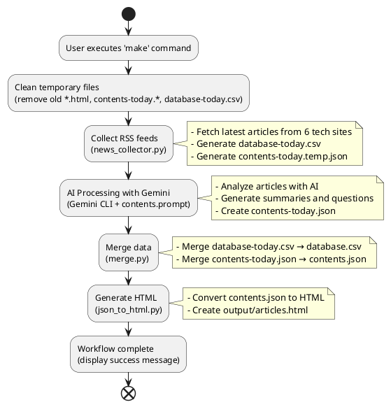

# English Tech News Automation

기술 뉴스를 자동으로 수집하고 영어 학습 자료로 변환하는 자동화 시스템입니다.

## 🚀 빠른 시작

### 전체 워크플로우 실행

```bash
make
```

단 한 번의 명령으로 다음 과정이 자동으로 실행됩니다:

1. **정리 (clean)**: 이전 임시 파일들 제거
2. **수집 (collect)**: RSS 피드에서 최신 기술 뉴스 수집
3. **AI 처리 (prompt)**: Gemini AI로 뉴스 분석 및 학습 자료 생성
4. **병합 (merge)**: 오늘 데이터를 기존 데이터베이스와 통합
5. **HTML 생성 (html)**: 웹으로 볼 수 있는 학습 자료 생성

## 📋 주요 기능

### 자동 뉴스 수집
- **TechCrunch**: 스타트업 및 기술 동향
- **VentureBeat**: AI 및 비즈니스 기술
- **Ars Technica**: 심층 기술 분석
- **TechRadar**: 하드웨어 및 소프트웨어 리뷰
- **The Verge**: 기술 문화 및 트렌드
- **Engadget**: 가젯 및 소비자 기술

### AI 기반 학습 자료 생성
- Gemini AI를 활용한 자동 요약
- 영어 학습에 최적화된 질문 생성
- 주요 기술 용어 및 개념 설명

### 웹 기반 학습 인터페이스
- 반응형 HTML 인터페이스
- 기사별 상세 페이지
- 검색 및 필터링 기능

## 🛠️ 개별 명령어

### 뉴스 수집만 실행
```bash
make collect
```

### AI 프롬프트만 실행
```bash
make prompt
```

### 데이터 병합만 실행
```bash
make merge
```

### HTML 생성만 실행
```bash
make html
```

### 최근 N개 기사만 HTML로 변환
```bash
make recent SIZE=10
```

### 최신 N개 기사만 HTML로 변환
```bash
make latest SIZE=5
```

### 정리 (임시 파일 삭제)
```bash
make clean
```

## 📂 파일 구조

```
.
├── README.md                 # 이 파일
├── Makefile                  # 메인 자동화 스크립트
├── gemini-cli-prompt.mk      # Gemini AI 실행 스크립트
├── news_collector.py         # RSS 피드 수집기
├── merge.py                  # 데이터 병합 도구
├── json_to_html.py           # HTML 변환기
├── contents.prompt           # AI 프롬프트 템플릿
├── database.csv              # 메인 뉴스 데이터베이스
├── contents.json             # 메인 학습 자료 데이터
├── database-today.csv        # 오늘 수집된 뉴스 (임시)
├── contents-today.json       # 오늘 생성된 학습 자료 (임시)
└── output/                   # 생성된 HTML 파일들
    └── articles.html
```

## 🔧 시스템 요구사항

- **Docker**: 컨테이너 실행을 위해 필요
- **Python 3.8+**: 스크립트 실행용
- **uv**: Python 패키지 관리자 (pip 대신 사용)
- **Make**: 자동화 스크립트 실행용

## 📖 사용 예시

### 매일 아침 뉴스 업데이트
```bash
# 하루의 시작 - 최신 기술 뉴스로 영어 공부
make
```

### 특정 개수의 기사만 확인
```bash
# 최근 5개 기사만 HTML로 변환
make recent SIZE=5

# 최신 3개 기사만 확인
make latest SIZE=3
```

### 웹 서버로 결과 확인
```bash
# HTML 파일을 웹 서버로 실행 (포트 8000)
make serve
```

## 📊 시스템 워크플로우



## 🎯 학습 워크플로우

1. **매일 실행**: `make` 명령으로 최신 뉴스 수집
2. **학습 자료 확인**: `output/articles.html` 파일을 브라우저로 열기
3. **영어 학습**: 생성된 질문과 요약을 활용한 학습
4. **진도 관리**: `database.csv`에서 학습 진도 확인

## 🔍 도움말

```bash
# 사용 가능한 모든 명령어 확인
make help
```

## 🚨 문제 해결

### Gemini API 할당량 초과
```bash
# API 상태 확인
make test-api
```

### Docker 이미지 문제
```bash
# 이미지 강제 재빌드
make -f gemini-cli-prompt.mk build
```

### 파일 정리가 필요한 경우
```bash
# 모든 임시 파일 삭제
make clean
```

---

**💡 팁**: 매일 아침 `make` 명령 한 번으로 최신 기술 뉴스를 영어 학습 자료로 만나보세요!